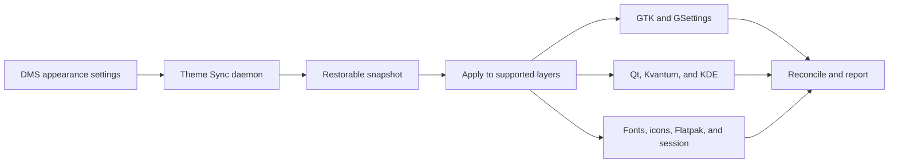

# DMS Theme Sync

**One source of truth for a Linux desktop that otherwise has none.**

Linux does not have one theme system. GTK 2, GTK 3, GTK 4/libadwaita, Qt 5,
Qt 6, KDE Frameworks, Kvantum, Fontconfig, XSettings, desktop portals,
Flatpak, and the session environment all make independent decisions. A valid
setting in one layer may be ignored in the next, and most failures end in a
silent fallback rather than a useful error.

[DMS Theme Sync](https://github.com/arqueon/dms-theme-sync) makes
[Dank Material Shell](https://danklinux.com/docs/dankmaterialshell) the
appearance authority and carries its decisions to as many of those layers as
possible. It then reads the system back, repairs unambiguous drift, and reports
what it could not safely fix.

It does not pretend to solve Linux theming. It makes the existing fragmentation
more predictable.

The plugin runs as a background **daemon**, provides an optional **bar widget**,
and includes a standalone **configuration dialog**.


## Contents

- [Why this plugin exists](#why-this-plugin-exists)
- [Dolphin: the problem in miniature](#dolphin-the-problem-in-miniature)
- [What it synchronizes](#what-it-synchronizes)
- [How synchronization works](#how-synchronization-works)
- [Hot reload for running applications](#hot-reload-for-running-applications)
- [Install](#install)
- [Configure](#configure)
- [Qt synchronization](#qt-synchronization)
- [Optional integrations](#optional-integrations)
- [Backups and restore](#backups-and-restore)
- [Files and settings the plugin manages](#files-and-settings-the-plugin-manages)
- [Optional packages](#optional-packages)
- [Limits](#limits)

## Why this plugin exists

The difficulty is not choosing a pleasant theme. It is getting every
application to interpret that choice consistently:

- **Each toolkit has its own authority.** GTK may read `settings.ini` and
  GSettings, Qt may depend on a platform-theme plugin before it even looks at
  `qt5ct.conf`, and KDE applications may use a cached copy of a color scheme in
  `kdeglobals`.
- **Precedence is often invisible.** A theme name, cursor name, or widget style
  can be written correctly while the required asset or plugin is missing. The
  application quietly falls back.
- **Several tools may write the same setting.** Appearance utilities, wallpaper
  scripts, compositors, and desktop portals can overwrite one another without
  sharing state.
- **Applications do not all reload alike.** KDE and qtct expose supported
  change notifications, GTK receives desktop setting changes through its
  backend, and any toolkit or application may still retain private caches.
- **Sandboxes and session variables form separate boundaries.** Flatpak
  applications cannot see every host theme file, and compositor environment
  changes do not automatically reach already-running processes.

DMS Theme Sync follows four rules:

1. **DMS decides; the plugin propagates.** Canonical DMS settings are changed
   through DMS's own API, never behind its back.
2. **Write, then verify.** A successful file write is not treated as proof that
   the setting took effect.
3. **Repair only what is unambiguous.** Conflicts that require a user decision
   are reported with the relevant tool or file instead of being overwritten.
4. **Take a snapshot first.** Every normal apply can be rolled back.

Configuration files may be managed by GNU Stow, lnk, chezmoi, or another
dotfile manager. When a managed path is a symbolic link, the plugin writes
through to its writable target and preserves the link itself. A dangling or
unwritable link is reported and left untouched.

## Dolphin: the problem in miniature

Dolphin is one of the clearest examples of the Linux theming problem. Its
Details view can paint alternating rows even when the rest of the desktop looks
unified. Dolphin has no switch to disable the stripes, and the color can come
from different places depending on the active Qt route.

The common fixes are unreliable:

1. A `QAbstractItemView` stylesheet does not reach Dolphin's custom
   `KItemListView`.
2. Making `AlternateBase` equal to `Base` still leaves stripes under Kvantum
   themes with `transparent_dolphin_view=true`: normal rows show the window
   color while alternate rows are still painted.
3. Deriving a scheme whose name still begins with `DankMatugen` lets DMS treat
   it as its own and reapply the original striped scheme during a palette
   refresh.
4. A uniform `kdeglobals` is not enough either: KDE remembers a color scheme
   **per application** (picking one in Dolphin's Settings → Color Scheme writes
   `ColorScheme=DankMatugen` into `dolphinrc`), and a pinned app reads DMS's
   scheme file directly. Each view captures its palette when it is created, so
   new tabs, split panes, and new windows stripe again even while older views
   sit uniform.

The plugin's **Uniform list backgrounds** option handles every supported Qt
route:

- it derives a separate `DankUniform.colors` scheme for the KColorScheme route;
- it equalizes the View alternate inside DMS's own `DankMatugen*.colors`
  exports, so apps pinned to them per-app stay uniform too (DMS regenerates
  these on every wallpaper or mode change; the plugin re-patches them at the
  same cadence, and turning the toggle off lets the next regeneration restore
  the stripes);
- it makes the alternate color fully transparent in the generated
  `DankMatugen` Kvantum output;
- when a same-author Kvantum pair is active, it creates a marked user-level
  shadow of that theme and changes only the alternate color.

Transparency is the important detail: it becomes a no-op whether Dolphin is
showing the base color or the window color underneath. Plugin-created shadows
carry a marker and are removed when no longer needed; an unmarked theme copy
made by the user is never edited.

After applying the correction, the plugin broadcasts the supported KDE and Qt
palette, font, cursor, and icon notifications. Windows that honor those
notifications can refresh in place; changing the Qt widget style or
platform-theme route, or an application keeping its own private palette cache,
still requires recreating the view or restarting the application. This focused
fix illustrates the plugin's larger purpose:
understand which layer owns the visible result, change only that layer, and
verify that another writer did not immediately undo it.

## What it synchronizes

| Area | What receives the DMS decision |
| --- | --- |
| **GTK** | GTK 2, GTK 3, GTK 4 settings, and the safe Matugen color import |
| **GNOME** | GSettings for theme, color scheme, icons, cursor, cursor size, and fonts |
| **Qt 5/6** | `qt5ct`/`qt6ct` style, icons, fonts, and the DMS KColorScheme palette |
| **Kvantum** | A matching GTK/Kvantum pair when installed, or an optional theme rendered from the DMS palette |
| **KDE** | `kdeglobals`, `kcminputrc`, and synchronized KColorScheme data |
| **Fontconfig** | `sans-serif`, `serif`, and `monospace` aliases |
| **X11/XWayland** | XSettings and XCursor defaults |
| **Flatpak** | Optional GTK configuration mounts plus icon and cursor overrides; appearance mode follows the portal |
| **Icons** | Optional Papirus folder overlay matched to the current Matugen accent |
| **Cursor** | Optional Bibata-Material variant matched to the current Matugen accent |
| **Terminals** | Optional font includes for kitty, Alacritty, and Ghostty |
| **Session environment** | Live systemd user environment plus persistent compositor/session configuration |

The configuration dialog also mirrors DMS appearance controls—color theme,
light/dark mode, Matugen scheme and contrast, fonts, icons, cursor, and cursor
size—so the canonical settings and the plugin-specific choices are available
in one place.

## How synchronization works



The daemon watches a signature containing the active colors, mode, fonts,
sizes, icons, cursor, and plugin options. A wallpaper change, a stock theme
change, or a downloaded/custom DMS theme therefore triggers a new apply
automatically. No wallpaper-manager hook is required.

Two details keep generated color data current:

- DMS does not always regenerate its GTK export for custom/downloaded themes,
  so the plugin asks DMS to refresh that export through DMS's own theme API.
- the plugin keeps the Matugen import in GTK 3 and GTK 4's user CSS, including
  the symlink case where `gtk.css` is already the generated palette itself.
  GTK loads that user provider once per process, so this benefits new launches;
  it is not presented as a hot-reload channel.

After applying, reconciliation checks the result. Among other things, it:

- reports dangling GTK theme symlinks without removing user-managed links;
- reasserts and reads back relevant GSettings values;
- verifies generic fonts with `fc-match`;
- checks that named themes and Qt style plugins actually exist;
- detects Qt combinations in which the selected style or palette will be
  ignored;
- refreshes and compares KDE's embedded KColorScheme sections;
- reports other appearance tools that may overwrite the result.

Anything safe and deterministic is repaired. Anything that implies ownership
of a user-maintained configuration is reported instead.

> [!IMPORTANT]
> DMS generates the dynamic colors. Keep DMS's **GTK**, **qt5ct**, and
> **qt6ct** Matugen templates enabled. The plugin consumes
> `dank-colors.css` and `DankMatugen.colors`; it deliberately does not launch a
> second Matugen process.

## Hot reload for running applications

After every successful apply or restore, the plugin runs
`scripts/reload-application-theme.sh`. The helper uses only notification paths
that the receiving toolkit actually implements:

| Stack | Live notification | Practical coverage |
| --- | --- | --- |
| **KDE Frameworks** | `KGlobalSettings` palette, font, and cursor changes, followed by all six `KIconLoader` groups | Views, toolbars, panels, dialogs, and small/desktop icons can discard shared KDE caches. |
| **Qt 5/6 through qt5ct/qt6ct** | Touch the existing `qt5ct.conf` and `qt6ct.conf`; their platform-theme watchers emit a Qt `ThemeChange` | Palette, fonts, style hints, and icons can refresh without changing the selected platform-theme route. Symlinks are followed, not replaced. |
| **GTK on Wayland** | Real desktop-setting changes arrive through the settings portal | Theme name, font, icon-theme name, cursor, and light/dark preference update when their value actually changes. |
| **GTK on X11/XWayland** | `xsettingsd` reloads the synchronized XSettings values | The same settings can update in running applications that consume XSettings. |

There is intentionally no fake GTK “reload everything” signal. GTK 3 and GTK
4 load `$XDG_CONFIG_HOME/gtk-3.0/gtk.css` or `gtk-4.0/gtk.css` into a static
process-local provider and do not monitor the file. Consequently, a Matugen
palette rewrite under the same CSS and theme names still requires restarting
that GTK application. GTK icon themes periodically recheck their search
directories when another lookup occurs, but already-rendered widgets may keep
their pixmap.

No external notification can invalidate an application's private cache. For
example, Krusader has caches outside `KIconLoader`; the shared parts refresh,
while its directory-view cache can survive until the view or process is
recreated. A live Matcha → Fusion → Breeze test also showed the boundary at the
widget level: Krusader repainted most shared controls, while one Dolphin window
adopted Fusion and then remained pixel-identical through Breeze and the Matcha
restore. The process had loaded both style plugins; the window simply did not
rebuild again. The helper therefore does not broadcast `StyleChanged` as a safe
hot reload. `apply-theme.sh` reports `QT_RESTART_REQUIRED:style` when it writes
a different Qt widget style, and a manual apply tells the user to restart open
Qt applications. Changing the Qt platform-theme plugin remains a process-startup
boundary too.

## Install

Requirements:

- Dank Material Shell **1.5.0 or newer**
- Bash

The plugin is available from the DMS plugin registry. Open
*DMS Settings → Plugins → Browse*, install **DMS Theme Sync**, and enable it.

For a manual installation:

```bash
git clone https://github.com/arqueon/dms-theme-sync.git \
  ~/.config/DankMaterialShell/plugins/dmsThemeSync
dms restart
```

Then enable **DMS Theme Sync** in *DMS Settings → Plugins*. Optionally add its
widget from *DMS Settings → Bar → Add Widget*.

## Configure

Open the dialog in any of these ways:

- **Bar widget:** left-click opens the dialog; right-click applies immediately.
- **IPC or key binding:** `dms ipc call dmsThemeSync configure`.
- **DMS Settings:** *Plugins → DMS Theme Sync*.

Controls mirrored from DMS update the canonical DMS settings. The plugin stores
only its own choices, including the per-mode GTK theme, font sizes, Qt route,
optional integrations, auto-apply behavior, and backup policy.

The main IPC commands are:

```bash
dms ipc call dmsThemeSync apply
dms ipc call dmsThemeSync configure
dms ipc call dmsThemeSync status

dms ipc call dmsThemeSync backup
dms ipc call dmsThemeSync backupNamed "before-experiments"
dms ipc call dmsThemeSync nameSnapshot SNAPSHOT_ID "known good"
dms ipc call dmsThemeSync restoreLatest
dms ipc call dmsThemeSync restore SNAPSHOT_ID
```

`status` returns formatted JSON. Environment changes affect newly launched
applications; existing Qt/KDE applications may need a restart, and persistent
session changes may require logging out and back in.

## Qt synchronization

Qt is where apparently valid settings most often become inert. A widget style
in `qt5ct.conf` matters only when a compatible Qt platform theme reads that
file; a KDE `.colors` palette matters only when the selected route can parse
it; a Kvantum style matters only when the Kvantum plugin and a usable Kvantum
theme are present.

The plugin reduces those interdependent choices to one **GTK ↔ Qt
synchronization route**:

| Route | Result |
| --- | --- |
| **Manual** *(default)* | Preserve the separate platform-theme and widget-style choices. Use this when the session already owns them. |
| **Automatic — visual fidelity with GTK** | Re-evaluate the best route on every apply: complete native Qt pair → same-author Kvantum pair → generated DMS Kvantum theme → DMS palette through `qt6ct-kde` → follow GTK. |
| **GTK–Qt twin theme** | Use the selected GTK theme's native Qt style (Breeze) or its installed Kvantum half, including Matcha, Qogir, Lavanda, WhiteSur, Orchis, Catppuccin, and adw-gtk3/KvLibadwaita. |
| **Kvantum from DMS** | Render and select a Kvantum theme from the live DMS palette. |
| **Dynamic wallpaper colors — Fusion** | Use `DankMatugen.colors` through `qt6ct-kde`; choose this when live wallpaper colors matter more than preserving a fixed Matcha/Qogir design. |
| **Follow GTK** | Use the `gtk3` platform theme so Qt colors follow the selected GTK theme. |

Every route except **Manual** chooses the platform theme and widget style as a
working pair. The settings page uses the same detection functions as the apply
helper, so it only offers routes and assets the current system can actually
load. Palette-only updates under an unchanged Fusion or Breeze style have the
best chance of reaching live windows. Changing the widget style writes the new
configuration immediately but requires restarting open Qt applications for a
complete, consistent result.

### Breeze as a native Qt pair

Breeze does not need a Kvantum imitation. Its GTK half is `breeze-gtk`, while
Qt loads the native `Breeze` QStyle from `breeze` (Qt 6) and `breeze5` (Qt 5).
Automatic and paired modes select this route only when both style plugins are
installed. A partial install is reported and the resolver continues to the next
safe route instead of leaving one Qt generation to fall back silently to
Fusion. `--probe-qt` exposes `native-pair` and `native-missing` for the settings
page and diagnostics.

### Why stock qt6ct is not enough

DMS exports `DankMatugen.colors` as a KDE KColorScheme with sections such as
`[Colors:Window]` and `[Colors:View]`. Stock `qt6ct` expects its own
`[ColorScheme]` array format and silently retains a default palette.
[`qt6ct-kde`](https://aur.archlinux.org/packages/qt6ct-kde) adds native
KColorScheme support and is therefore the recommended non-Kvantum route.
Package names vary outside Arch-based distributions.

### Kvantum and same-author pairs

Kvantum draws widgets from its own `.kvconfig` and SVG files; it does not use
the qtXct palette for those colors. Selecting the `kvantum` style without a
matching theme can therefore remove the DMS palette rather than improve it.

When enabled, the plugin either:

- selects an installed Kvantum counterpart from the same design as the GTK
  theme; or
- renders `DankMatugen.kvconfig` and `DankMatugen.svg` from the current DMS
  Material roles.

The templates are vendored under `assets/kvantum/`, so applying a theme does not
depend on the network. Missing roles or an unavailable Kvantum style are
reported rather than replaced with an invalid fallback.

## Optional integrations

### Flatpak

Sandboxed applications do not see every host theme file. **Synchronize
Flatpak** grants read-only access to the relevant GTK and theme directories and
creates user-level overrides for `ICON_THEME` and `XCURSOR_THEME`. Light/dark
mode continues to come from the desktop portal. The plugin deliberately unsets
`GTK_THEME`: GTK treats it as a debugging override, and using a GTK 3 theme
there can break the spacing and controls of GTK 4/libadwaita applications.
GTK 4 receives only the host CSS files (including the Matugen color import),
not `settings.ini`; libadwaita therefore keeps its own widget metrics and style
manager while still receiving the generated palette.

Upgrading also removes the legacy global `GTK_THEME` value written by older
plugin versions. If Flatpak synchronization is already off, the migration runs
only when the remaining override has the plugin's GTK/icon signature; unrelated
user overrides are left intact.

### Folder accent

The folder-color option creates a small user-level overlay that inherits from
Papirus and replaces only folder icons. It chooses the nearest hue to the
Matugen accent without copying the complete icon theme.

The settings page distinguishes three states: Papirus installed, Papirus
selected as DMS's canonical icon theme, and the generated overlay active. If
Papirus is installed while DMS still uses another theme, the option explains
why it is blocked and offers an explicit **Use Papirus-Dark** button. Icon-theme
selection is verified after writing to `SettingsData`; a rejected or reverted
choice is reported instead of silently snapping back. IPC `status` exposes the
discovered themes, folder base, capability, and blocking reason.

When the GTK theme is Catppuccin and
[`papirus-folders-catppuccin`](https://github.com/catppuccin/papirus-folders)
is installed, the plugin selects the matching flavor and accent instead of a
plain nearest-color approximation.

### Cursor accent

The cursor-color option applies the same idea to the pointer. Build the
[material-bibata-cursor](https://github.com/SakibShahariar/material-bibata-cursor)
packs once (28 `Bibata-Material-*` variants, each recolored around one
Material accent, installed to `~/.icons`); on every apply the plugin maps the
Matugen accent onto the nearest installed variant by CIE hue and hands the
choice to DMS's own cursor setting, which propagates it everywhere the cursor
theme is already synchronized (GTK, Qt, KDE, XResources, compositor, Flatpak).
A neutral accent selects a neutral variant (Grey, Slate, Cloud…) instead of
landing on an arbitrary hue. The plugin never builds cursors itself and only
chooses among variants that are actually installed; turning the option off
returns the cursor to the theme recorded before the first switch.

### Focused-border contrast (Niri)

Matugen's primary is chosen to carry icons, text and selections; in dark mode
it can be bright enough that Niri's focused-window border washes out against
light window content. **Dim the focused-window border** overrides only the
`border` and `focus-ring` active colors with the darker tone Matugen already
derives from the same accent — `primary_container` (dark), the color DMS's own
template assigns to the recent-windows highlight — so the border still follows
every wallpaper change, just two tones deeper. Everything else (inactive and
urgent borders, icons, text, selections) keeps DMS's colors.

No color math is invented and no DMS file is touched: the two values are read
back from the `dms/colors.kdl` DMS generates, and the override rides the
plugin's own `dms-theme-sync.kdl`, which `config.kdl` loads after DMS's
include — later includes win in Niri, property by property. Turning the option
off stops writing the block and the next apply returns the border to DMS. The
combined configuration is validated with `niri validate` and rolled back if it
does not parse. The option has no effect on other compositors.

### Terminal fonts

Terminal emulators use their own configuration syntax, so toolkit
synchronization alone cannot reliably set their font. **Synchronize terminal
fonts** generates:

```text
~/.config/dms-theme-sync/kitty.conf
~/.config/dms-theme-sync/alacritty.toml
~/.config/dms-theme-sync/ghostty.conf
```

Reference the appropriate file once from the terminal's own configuration:

```conf
# kitty
include ~/.config/dms-theme-sync/kitty.conf

# Ghostty
config-file = ~/.config/dms-theme-sync/ghostty.conf
```

```toml
# Alacritty
[general]
import = ["~/.config/dms-theme-sync/alacritty.toml"]
```

The plugin generates only these includes; it does not inject them into the
terminal's configuration.

### Compositor and session environment

Cursor variables and an optional Qt platform theme must reach the process
environment. The plugin updates the live systemd user environment and persists
the values according to the detected session:

| Session | Persistent state |
| --- | --- |
| **Niri** | Generated `dms-theme-sync.kdl` plus one top-level include in `config.kdl`; changes are validated and rolled back on failure |
| **Hyprland** | Generated hyprlang or Lua include, matching the existing main config |
| **labwc** | A delimited plugin block in labwc's environment file |
| **Other systemd/uwsm sessions** | `~/.config/environment.d/90-dms-theme-sync.conf` |

The generated include is placed before user override layers when possible, so a
deliberate user setting can still win. Existing applications and compositor
startup commands need a new session to inherit persistent changes.

## Backups and restore

Backups are enabled by default. Before each apply, the plugin snapshots:

- its managed configuration files recorded in the snapshot manifest;
- the content behind writable dotmanager symlinks, while preserving the link;
- the user-wide Flatpak override changed by the sandbox integration;
- whether plugin-created files previously existed;
- relevant GSettings values;
- the cursor and Qt session environment.

The plugin creates the snapshot **before** applying changes. If backup creation
fails, synchronization stops without editing the theme. A successful apply logs
both the snapshot ID and the exact `dms ipc` restore command.

Snapshots live at:

```text
~/.local/state/DankMaterialShell/plugins/dmsThemeSync/backups/
```

Retention is configurable from **1 to 30** snapshots and defaults to **10**.
Named snapshots are pinned: they are neither counted nor deleted by normal
rotation. Restoring disables auto-apply first so the recovered state is not
immediately overwritten.

Use the dialog's backup selector, the IPC commands above, or the helper:

```bash
scripts/theme-snapshot.sh list
scripts/theme-snapshot.sh backup --retention 10 --label manual
scripts/theme-snapshot.sh backup --name "before-experiments"
scripts/theme-snapshot.sh name --snapshot SNAPSHOT_ID --name "known good"
scripts/theme-snapshot.sh restore --snapshot latest
```

Replace `SNAPSHOT_ID` with an ID returned by `list` or shown in the dialog.
For example:

```bash
dms ipc call dmsThemeSync restore 20260806-220050
```

Restoration recovers the captured files, symlink-target contents, Flatpak
override, GSettings, and session variables. It also disables automatic sync so
the recovered state remains in place. It does not uninstall theme packages or
restart already-running applications.

## Files and settings the plugin manages

The helper makes key-level, idempotent edits to existing GTK, Qt, KDE, and
session files; it does not replace those files wholesale. Depending on enabled
options, it may also create:

- `~/.config/fontconfig/conf.d/99-dms-theme-sync.conf`
- `~/.local/share/icons/<base>-DankFolders/`
- `~/.local/share/color-schemes/DankUniform.colors`
- an equalized View alternate inside DMS's `DankMatugen*.colors` exports
  (while **Uniform list backgrounds** is on; DMS's next regeneration restores
  the original values once the option is off)
- `~/.config/Kvantum/DankMatugen/`
- a marked `~/.config/Kvantum/<paired-theme>/` shadow for uniform Dolphin lists
- `~/.config/environment.d/90-dms-theme-sync.conf`
- `~/.config/niri/dms-theme-sync.kdl`
- `~/.config/hypr/dms-theme-sync.conf` or `dms-theme-sync.lua`
- a delimited block in `~/.config/labwc/environment`
- `~/.config/dms-theme-sync/{kitty.conf,alacritty.toml,ghostty.conf}`

Generated overlays, derived schemes, and marked Kvantum shadows are removed
when their option is disabled or they become stale. Unmarked user-created
Kvantum themes are never modified.

For isolated inspection and tests, the apply helper supports:

```text
--dry-run       list intended writes
--no-runtime    write only to the target HOME/XDG paths; do not call runtime services
```

## Optional packages

The plugin degrades gracefully when a toolkit is absent. Install only the
components used by the desktop:

| Package or command | Purpose |
| --- | --- |
| `gsettings` / `dconf` | GNOME settings and portal hints |
| `qt5ct` and `qt6ct-kde` | Qt configuration and native DMS KColorScheme support |
| `qt6-tools` / `qtdiag` | Detect loadable Qt platform themes and styles |
| `breeze`, `breeze5`, and `breeze-gtk` | Complete native Breeze pair for Qt 6, Qt 5, and GTK |
| `kvantum` | SVG-drawn Qt widgets and same-author theme pairs |
| `xsettingsd` | Legacy X11/XWayland applications |
| `papirus-icon-theme` | Generated folder-color overlay |
| `papirus-folders-catppuccin` | Exact Catppuccin folder variants |
| [material-bibata-cursor](https://github.com/SakibShahariar/material-bibata-cursor) builds | Accent-matched cursor variants (`Bibata-Material-*`) |
| Selected GTK theme and engine | Structural GTK appearance; GTK 2 themes may need Murrine |
| Matching Kvantum theme packages | Matcha, Qogir, Lavanda, WhiteSur, Orchis, Catppuccin, or KvLibadwaita pairing |

## Limits

- GTK 4/libadwaita does not honor arbitrary `GTK_THEME` widget themes. DMS's
  generated GTK 4 CSS remains the color source; fonts, icons, cursor, and the
  light/dark preference can still be synchronized.
- GTK 3/4 do not monitor their user `gtk.css`; restart running GTK applications
  after a same-name Matugen CSS palette change.
- The KDE/Qt palette, font, cursor, and icon reload is best effort. Restart
  applications after changing the widget style or platform-theme route, or
  when an application keeps a private cache.
- Persistent environment changes may require logging out and back in.
- Flatpak synchronization is opt-in, and not every Electron or Java
  application follows the same host-theme conventions.
- A missing theme, style plugin, or toolkit cannot be synthesized. The plugin
  falls back where it can and reports the missing component.
- Another appearance manager can still overwrite shared settings. Reconciliation
  identifies known conflicts, but it does not seize ownership of unrelated
  user configuration.

Linux theming remains fragmented. The goal is narrower and practical: make one
decision travel farther, make silent failures visible, and make the result
recoverable.

## Availability

Source: <https://github.com/arqueon/dms-theme-sync>

The plugin is listed in the
[DMS plugin registry](https://danklinux.com/plugins) and can be installed from
*DMS Settings → Plugins*.

## License

[GPL-3.0-or-later](LICENSE)
